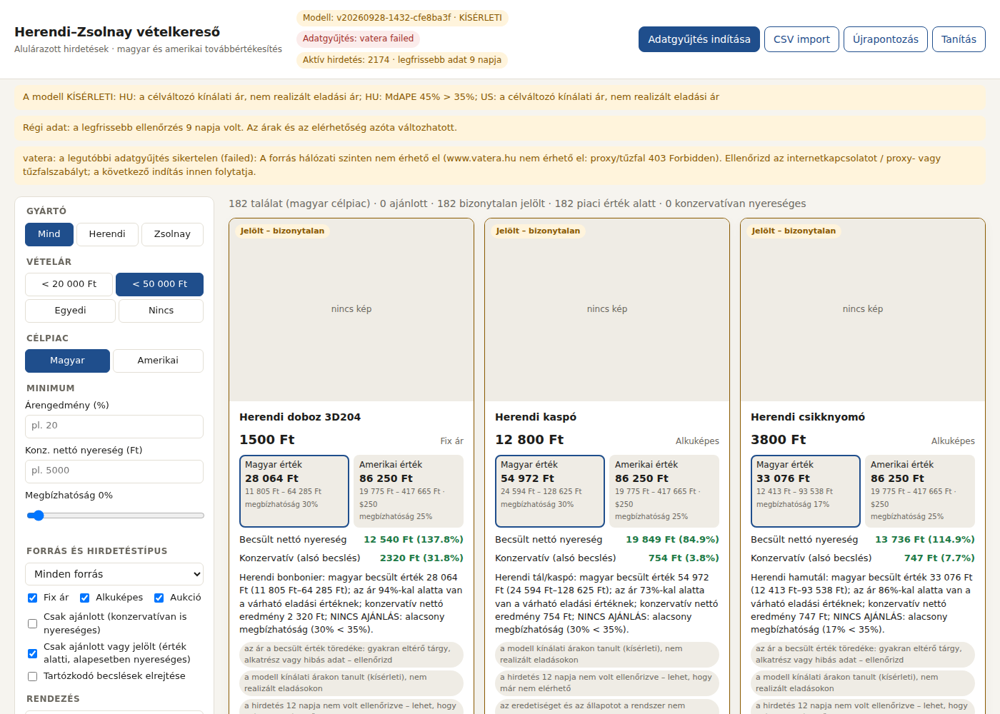

# Herendi–Zsolnay vételkereső

Magyar piactereken (elsődlegesen Vatera, másodlagosan Jófogás) keres potenciálisan alulárazott Herendi és Zsolnay porcelánt. A magyarországi és az amerikai továbbértékesítést külön értékeli: piaci értékbecslés, becslési intervallum, validált megbízhatóság, költség utáni nettó nyereség konzervatív forgatókönyvvel, és kattintható link az eredeti hirdetésre.



> **Állapot (2026-09-28):** az adatgyűjtési, képfeldolgozási, becslési, rangsorolási és dashboard-infrastruktúra működik és tesztelt. A modell **KÍSÉRLETI**: 1251 Herendi/Zsolnay tanítósora van, mind kínálati ár és **kép nélkül**. A képalapú árbecsléshez **sok tízezer képes adat** kell; a rendszer ezt a léptéket kezeli (tömeges eBay-gyűjtés képekkel, általános porcelánkorpusz előtanításhoz, kétlépcsős tanítás, CLIP-finomhangolás), de a gyűjtéshez hálózati hozzáférés és eBay API-kulcs kell. Részletek: [Nagy léptékű adat](#nagy-léptékű-adat-a-képalapú-becsléshez), [Mi működik valós adattal](#mi-működik-valós-adattal-és-mi-nem), [docs/ADATFORRASOK.md](docs/ADATFORRASOK.md).

## Gyors indítás

```bash
pip install -r requirements.txt            # Python 3.11+; CPU elég
cp config/settings.example.toml config/settings.toml   # opcionális: saját költségek, árfolyam
python -m porcelan setup-models            # CLIP ViT-B/32 súlyok (605 MB, GitHub, SHA-256 ellenőrzés)
python -m porcelan import-repo             # a repóban lévő valós Vatera-adatok (2026-09-16/19) importja
python -m porcelan score                   # becslés a verziózott modellel (models/CURRENT) – nincs újratanítás
python -m porcelan serve                   # dashboard: http://127.0.0.1:8000
```

Friss adat (olyan gépről, ahonnan a Vatera elérhető):

```bash
python -m porcelan crawl --source vatera   # teljes, folytatható bejárás; Ctrl+C után folytatja
python -m porcelan images                  # képletöltés, duplikátumszűrés, CLIP-beágyazás, képi előszűrés
python -m porcelan score                   # csak a változott hirdetéseket becsüli újra
```

A dashboardról ugyanez gombokkal indítható („Adatgyűjtés indítása”, „CSV import”, „eBay-gyűjtés”, „Újrapontozás”, „Tanítás”). A feladatok háttérfolyamatként futnak, folyamatjelzővel.

## Pontos piaci ár (cél: ±10%)

A legfontosabb első lépés: képből és leírásból megmondani egy adott termék **valódi piaci árát**, legfeljebb 10% eltéréssel. Csak ezután jön az összevetés a hirdetési árral. Ehhez a rendszer:
1. **pontosan azonosítja a terméket** (gyártó + formaszám + mintakód, pl. Herend `711-0-00 VBO`) a szövegből és – a katalógusképekhez és azonosított hirdetésképekhez hasonlítva – a képből (`identify`);
2. a **piaci árat az azonos termék eladásaiból** számolja, a kép+szöveg modell becslésével bizonytalanság szerint kombinálva, és megadja, milyen valószínűséggel van ±10%-on belül (`sku_model.py`);
3. **„Pontos ár (±10%)”** jelzést csak validált esetben ad; máshol sávot mond, és megnevezi, mi hiányzik.

Számszerűen: ha azonos termék eladásai 20–40%-kal szórnak, akkor termékenként **3–9 realizált eladás** kell a 10%-os mediánhibához, és **11–44 eladás** ahhoz, hogy az esetek 90%-a ±10%-on belül legyen. Egyetlen konkrét eladás árát ennél pontosabban egy modell sem találhatja el. A mostani adatban 0 terméknek van két független eladása, ezért a cél még **nem mérhető és nem érhető el**. Részletek, módszer, adatigény: [docs/PONTOS_PIACI_AR.md](docs/PONTOS_PIACI_AR.md).

```bash
python -m porcelan import-catalog katalogus.csv   # cikkszám, név, méret, hivatalos ár, kép (config/catalog.example.csv)
python -m porcelan identify                       # formaszám + mintakód szövegből és képből
python -m porcelan sku-eval                       # ±10%-on belüli arány, piaci zajszint, szükséges eladásszám
```

## Nagy léptékű adat a képalapú becsléshez

Megbízható, képből dolgozó árbecsléshez nem néhány száz, hanem **sok tízezer (előtanításhoz százezres nagyságrendű) kép+ár pár** kell. Csak Herendi/Zsolnay tárgyból, képpel és árral ennyi nem gyűlik össze rövid idő alatt, ezért a rendszer lépcsőzetesen tanul:

| Lépés | Adat | Cél (settings `[targets]`) | Parancs |
|---|---|---:|---|
| 1. Előtanítás | általános porcelán/kerámia kép+ár (eBay, Vatera; Meissen, Royal Copenhagen, Lladró, Hollóházi…) | 200 000 | `harvest-ebay`, `crawl --corpus general` |
| 2. Finomhangolás | Herendi/Zsolnay kép+ár (HU+US) | 20 000 | `harvest-ebay`, `crawl` |
| 3. Kalibráció és validáció | realizált ár piaconként (lezárult aukciók, leütési árak, saját eladások) | 3 000 / piac | `crawl` (záró licitek), `import-prices` |

```bash
export EBAY_CLIENT_ID=...  EBAY_CLIENT_SECRET=...   # ingyenes: developer.ebay.com
python -m porcelan harvest-ebay --images      # folytatható; a 10 000-es API-korlátot ársáv-felbontással kerüli el
python -m porcelan crawl --corpus general     # Vatera általános porcelán/kerámia korpusz (kártyaszintű kép+ár)
python -m porcelan images                     # képletöltés, pHash-dedup (sáv-index), CLIP-beágyazás
python -m porcelan data-volume                # hol tart a gyűjtés a célokhoz képest (dashboardon is látszik)
python -m porcelan finetune-vision --epochs 3 --unfreeze 2   # CLIP képenkóder finomhangolása árra (GPU ajánlott)
python -m porcelan train                      # előtanítás az általános korpuszon → finomhangolás Herendi/Zsolnay adaton
python -m porcelan learning-curve             # hiba az adatmennyiség függvényében + becslés a szükséges adatra
```

Mit csinál a rendszer a nagy adattal:
- **Gyűjtés:** az eBay Browse API egy lekérdezésre legfeljebb 10 000 találatot ad. A gyűjtő ezért lekérdezésenként ársávokra bont, és a túl nagy sávot adaptívan kettévágja; az állapot a `harvest_slices` táblában van. Napi kvóta (HTTP 429) vagy megszakítás után folytatja. Tételenként legfeljebb 4 kép, típusos ár-rekord (`asking_active`), korpusz szerint (Herendi/Zsolnay vagy általános).
- **Skálázható duplikátumszűrés:** pHash sáv-index (8 × 8 bit), MinHash-LSH a közel azonos címekre, FAISS a hasonló tételek keresésére. Százezres adaton sincs páronkénti összehasonlítás.
- **Szivárgásvédelem:** az általános korpusz sorai csak előtanításra mennek. Ha egy általános tétel képe vagy címe egy Herendi/Zsolnay validációs vagy tesztcsoporthoz kötődik, kimarad.
- **Kétlépcsős tanítás:** a neurális becslő előbb az általános korpuszon tanul, majd kisebb tanulási rátával a Herendi/Zsolnay adaton finomhangol. Az értékelés mindig a Herendi/Zsolnay teszthalmazon történik. A „csak Herendi/Zsolnay” és az „előtanított” változat eredménye egymás mellett látszik.
- **Képenkóder finomhangolása:** a CLIP ViT-B/32 utolsó blokkjai árra tanulnak. Ez mérhető, tisztán képalapú becslést is ad, és a finomhangolt képbeágyazás (külön verzió: `models/vision/`) a becslőmodell bemenete lesz.
- **A kép hatásának mérése:** ha van elég képes tanítósor, a rendszer ugyanazt a modellt kép nélkül is betanítja (`deep_no_image`), és a képes tesztsorokon összeveti a kettőt.
- **Adatmennyiségi kapu:** a „validált” státuszhoz piaconként legalább 10 000 tanítósor és 10 000 képes tanítósor kell (`[validation]`).

## Használat a dashboardon

1. Válaszd ki a gyártót (Herendi / Zsolnay), a vételárat (< 20 000 Ft, < 50 000 Ft vagy egyedi) és a célpiacot (magyar / amerikai).
2. Állíts be minimum árengedményt, konzervatív nettó nyereséget és megbízhatóságot. Szűrhetsz forrásra és hirdetéstípusra (fix / alku / aukció), és többféleképpen rendezhetsz.
3. A kártyákon látszik a kép, a megnevezés, az ár és a típus, a magyar és az amerikai érték intervallummal, a nettó nyereség és a megtérülés (alap és konzervatív), aukciónál a max. javasolt licit, a rövid indoklás, a kockázatok, az utolsó ellenőrzés ideje és a **Hirdetés megnyitása** gomb.
4. A **Részletek** nézet tartalmazza az összes képet, a leírást, a tételes költségszámítást mindkét forgatókönyvre, a feltételezéseket, az összehasonlítható tételeket (ártípussal és dátummal), az árkövetést és a visszakövethetőséget (modellverzió, bemenet-hash, forrás-azonosító).
5. A fejléc mutatja a modell státuszát és verzióját, az utolsó sikeres adatgyűjtést és az adatok frissességét. Hiányzó modell, régi adat vagy hibás adatforrás esetén figyelmeztetés jelenik meg.

Jelzések:
- **Ajánlott**: a konzervatív (alsó becslésű) forgatókönyv is legalább 5000 Ft nettó nyereséget ad, és a validált megbízhatóság eléri a küszöböt.
- **Jelölt – bizonytalan**: a várható eladási érték alatt van, és alapesetben nyereséges, de a megbízhatóság a küszöb alatt marad.
- **Nincs ajánlás**: a rendszer tartózkodik. Ennek oka lehet nem azonosított gyártó, sérült tárgy, kevés hasonló tétel, csak csoportmedián becslés, inaktív hirdetés vagy hiányzó ár.
- Az „USA-érték alatt” és az „USA-ba nyereséges” külön jelzés.
- Aukciónál a nyereség feltételes („ha ezen a licitten nyered”), és a rendszer a maximális javasolt licitet adja meg. Rögzített áron megszerezhető nyereséget nem ígér.

## Architektúra

```
Adatgyűjtés ──► tisztítás ──► képfeldolgozás ──► azonosítás ──► árbecslés ──► költség ──► rangsor ──► dashboard
crawler.py      text.py       images.py          text.py        predict.py    costs.py    ranking.py   api.py + web/
sources/*       importers.py  vision.py (CLIP)   vision.py      model.py                              jobs.py (háttér)
   │                                                               ▲
   └──────── SQLite (data/hzfinder.sqlite): listings · observations · images · embeddings · price_records
             · crawl_runs · frontier · coverage · estimates · recommendation_log · jobs
                                                                   │
                         train.py ──► models/<verzió>/ (manifest, súlyok, pipeline, index, tanítóadat) ──► models/CURRENT
```

| Modul | Feladat |
|---|---|
| `porcelan/sources/vatera.py` | Keresés 55 névváltozatra, elírásra és kapcsolódó kifejezésre (herendy, zsolnai, zolnay, eozin, pirogránit, halpikkelyes…). Kategóriafelfedezés és -bejárás, teljes lapozás a valódi végéig, a jelzett találatszám kiolvasása. Termékoldal: eladási típus, ár, szállítási díj, licit, lejárat, képek, kategória, készlet, státusz. |
| `porcelan/crawler.py` | SQLite-frontier prioritással: a releváns keresések előbb jönnek, a teljes katalógus (`--full-catalog`) alacsony prioritással. Folytatható futás, inkrementális (a részletes oldalt csak új, megváltozott vagy 72 óránál régebben ellenőrzött hirdetéshez tölti le), árkövetés (`observations`). Státuszok: active / ended / sold / disappeared / removed. Lezárult aukciónál rögzíti a záró licitet. Lefedettséget mér keresésenként; részleges futást nem nevez teljesnek. |
| `porcelan/net.py` | Átlátható User-Agent, hostonkénti késleltetés, robots.txt, cache. 403/429/CAPTCHA esetén leáll (`blocked`), nem kerüli meg. |
| `porcelan/sources/jofogas.py`, `ebay.py` | Jófogás mint második forrás (`jofogas.enabled`). eBay Browse API (hivatalos, US aktív kínálat). |
| `porcelan/importers.py` | Régi `run.py` CSV-k, riport-táblák, PicClick-összehasonlítók, általános ár-CSV (realizált, leütési, kínálati ár). Idempotens. |
| `porcelan/images.py` | Letöltés, normalizált tárolás, sha256 és pHash, közel azonos képek duplikátumszűrése. |
| `porcelan/vision.py` | OpenCLIP ViT-B/32 (LAION-400M), fagyasztott enkóder. Kép- és szövegbeágyazás cache-sel; zero-shot képi előszűrés a márkanév nélküli porcelánhirdetésekhez. |
| `porcelan/text.py` | Gyártó, tárgytípus, dekor, méret, darabszám, állapot (sérült, javított, hiányos), jelzések (talpjelzés, kézzel festett, aranyozott, szignó, antik), utánzat- és nem-porcelán-szűrés, kanonikus angol leírás a CLIP-hez. |
| `porcelan/dataset.py` | Ártípus-kezelés, piaconkénti pénznem, újrahirdetés-szűrés. Csoportképzés közös kép és közel azonos cím alapján. Csoportszintű train/val/test felosztás; időbeli teszt, ha az adat legalább 30 napot lefed. |
| `porcelan/model.py`, `train.py` | Csoportmedián-baseline, GBM kvantilis-regresszió, multimodális neurális modell (CLIP kép + szöveg + TF-IDF + strukturált + visszakeresett hasonló tételek; közös törzs, HU/US kvantilisfejek, 5 tagú ensemble), ablation CLIP nélkül. Konformális intervallum-kalibráció, validációs megbízhatóság, bootstrap CI, „validált” kapu. |
| `porcelan/costs.py`, `ranking.py` | Célpiaconkénti költségek (szállítás, csomagolás, platform- és fizetési díj, devizaváltás, USA vám/tarifa, adó, kockázati tartalék), alap és konzervatív forgatókönyv, max. licit, tartózkodási szabályok, indoklás, kockázatok, hiányzó információk. |

## Parancsok

| Parancs | Mit csinál |
|---|---|
| `python -m porcelan crawl [--source vatera\|jofogas] [--full-catalog] [--max-requests N] [--time-budget S] [--no-resume]` | adatgyűjtés; kilépési kód 2 blokkolásnál vagy hibánál |
| `python -m porcelan import-repo` | a repóban tárolt valós adatok importja |
| `python -m porcelan import-csv out/run_*/vatera_osszes.csv` | régi scrape CSV-k importja |
| `python -m porcelan import-prices eladasok.csv` | realizált, leütési vagy kínálati árak (`config/prices.example.csv` fejléc) |
| `python -m porcelan import-ebay` | eBay Browse API, kisebb mintához (EBAY_CLIENT_ID / EBAY_CLIENT_SECRET) |
| `python -m porcelan harvest-ebay [--max-items N] [--images]` | tömeges, folytatható eBay-gyűjtés képekkel (ársáv-felbontás) |
| `python -m porcelan crawl --corpus general` | Vatera általános porcelán/kerámia korpusz az előtanításhoz |
| `python -m porcelan data-volume` | tanítóadat-mennyiség a célokhoz képest |
| `python -m porcelan finetune-vision [--epochs 3 --unfreeze 2 --batch 64]` | CLIP képenkóder finomhangolása árra |
| `python -m porcelan learning-curve [--fractions 0.1,0.25,0.5,1.0]` | tanulási görbe és a szükséges adatmennyiség becslése |
| `python -m porcelan images` | képek, dedup, CLIP-beágyazás, képi előszűrés |
| `python -m porcelan train [--seed 42] [--seeds 5] [--no-clip]` | reprodukálható tanítás és értékelés → `models/<verzió>/EVALUATION.md` |
| `python -m porcelan score [--force]` | becslések (változatlan bemenetre és modellre kihagyja) |
| `python -m porcelan top --brand Herendi --max-price 50000 --market HU` | a legjobb találatok a parancssorban |
| `python -m porcelan status` / `evaluate-recommendations` | állapot; ajánlások utólagos ellenőrzése lezárult aukciókon |
| `python -m porcelan serve [--host 127.0.0.1 --port 8000]` | dashboard |
| `python -m porcelan identify` / `sku-eval` / `import-catalog` | pontos termékazonosítás, cikkszám-szintű ±10%-os értékelés, katalógus |
| `python -m pytest -q tests` | tesztek (63 db, hálózat nélkül; a képi tesztek CLIP-súlyokat igényelnek) |

Konfiguráció: `config/settings.example.toml` (másold `config/settings.toml` néven). Itt állíthatók a keresőkifejezések, a kategóriák, a lekérési gyakoriság és a cache, az árfolyam, a HU/US költségek és adók, a rangsorolási küszöbök és a validációs feltételek. A költség-feltételezések a dashboardon ideiglenesen felülírhatók.

## Modell és mért eredmények

Az aktuális verzió: `models/v20260928-1810-522878a8` (teljes riport: [EVALUATION.md](models/v20260928-1810-522878a8/EVALUATION.md), [docs/MODELL_ERTEKELES.md](docs/MODELL_ERTEKELES.md)).

A mérés tesztkészleten készült (csoportszintű, a tanítástól és a validációtól elkülönítve), a célváltozó **kínálati ár**, a tanítóadatban **nincs kép**. Az intervallumok a validációs halmazon kalibráltak.

| Modell | Piac | n | MAE | MdAPE (95% CI) | ±25%-on belül | 80%-os int. lefedettség |
|---|---|---:|---:|---:|---:|---:|
| Csoportmedián (baseline) | HU | 246 | 51 088 Ft | 67,1% (61–75%) | 17,5% | 78,9% |
| GBM kvantilis | HU | 246 | 41 042 Ft | 46,8% (39–52%) | 30,9% | 76,8% |
| **Multimodális neurális (★)** | HU | 246 | **40 426 Ft** | **43,4% (38–47%)** | 29,3% | 76,0% |
| Neurális, CLIP nélkül | HU | 246 | 40 927 Ft | 42,2% (38–48%) | 26,8% | 72,4% |
| Csoportmedián (baseline) | US | 19 | 470 USD | 70,7% (58–148%) | 15,8% | 84,2% |
| Multimodális neurális (★) | US | 19 | 454 USD | 75,4% (47–196%) | 15,8% | 63,2% |

★ = a validációs halmazon kiválasztott, élesben használt modell. Gyártónként (HU, ★): Herendi MdAPE 43,1% (n = 141), Zsolnay 43,5% (n = 105).

### Tanulási görbe (valós HU adat, azonos teszthalmaz)

| HU tanítósor | 128 | 308 | 603 | 1 167 |
|---|---:|---:|---:|---:|
| MdAPE | 60,0% | 55,0% | 48,5% | 44,1% |

A hiba az adatmennyiséggel folyamatosan csökken. A hatványtörvény-extrapoláció szerint ezzel az adattípussal (csak szöveg, kínálati ár) kb. **6 200** HU tanítósor kellene 35% MdAPE-hez; ez nagyságrendi becslés, nem ígéret. Az US-extrapoláció 19 tesztminta miatt megbízhatatlan. Részletek: [models/learning_curve/LEARNING_CURVE.md](models/learning_curve/LEARNING_CURVE.md).

Értelmezés:
- A neurális modell a HU piacon **érdemben jobb a baseline-nál**: a MAE 21%-kal, az MdAPE 24 százalékponttal kisebb, a bootstrap-intervallumok nem fedik át egymást. A GBM-hez és a CLIP nélküli változathoz képest a különbség a bizonytalanságon belül van.
- **A képi ág még nem tanult**, mert nincs letöltött kép. A mechanikát (beágyazás, finomhangolás, képes tanítás, ablation) szintetikus képekkel teszteltük.
- Az US-adat (84 tanítósor, 19 tesztminta) túl kevés: ott a választott modell a teszten nem jobb a baseline-nál, ezért a rendszer az amerikai piacra nem ad ajánlást.
- A megbízhatósági jelzés kalibrált (HU): az átlagos jelzett érték 30,1%, a tényleges ±25%-os találati arány 29,3%.
- **Ajánlások találati pontossága: nem mérhető** ellenőrző adat hiányában (`recommendation_log`, `evaluate-recommendations`).

## Mi működik valós adattal, és mi nem

**Valós adattal működik és ellenőrzött:**
- A 2026-09-16-i élő Vatera-futás 2321 elfogadott hirdetésének importja, valamint 14 részletes termékoldal (2026-09-19) és 155 eBay-kínálati ár.
- Tanítás, értékelés, verziózott mentés és betöltés, becslés mind a 2174 aktívként tárolt hirdetésre (kb. 19 s), inkrementális újrapontozás (0 újrabecslés változatlan bemenetnél).
- Tanulási görbe a valós HU adaton (fent).
- A dashboard minden szűrővel, rendezéssel és a részletes nézettel. A háttérfeladat-indítás az API-n keresztül külön folyamatban fut. Mobil nézet vízszintes görgetés nélkül.
- Élő bejárási kísérlet: a Vatera ebből a környezetből nem érhető el (hálózati szabályzat, proxy 403). A crawler ezt `failed` állapotként, folytatható módon rögzíti, és a dashboard hibás adatforrásként jelzi.

**Offline tesztekkel ellenőrzött, élesben még nem futott:**
- A Vatera találati és termékoldal-parsere. A kártyaattribútumok (`data-product-id`, `data-gtm-*`) és a termékoldal-jelek a korábbi élő futásokból ismertek, de a lapozás-, kategória- és képlinkformátumot élesben kell ellenőrizni (`python diagnose.py`, majd `python -m porcelan crawl --max-requests 20`).
- A Jófogás-adapter (tűrő parser, élesben nem ellenőrzött).
- Képletöltés, pHash-dedup, CLIP-beágyazás, zero-shot előszűrés, képes tanítás és a CLIP-képenkóder finomhangolása (szintetikus képekkel tesztelve; a képi előszűrés küszöbe nincs validálva).
- Tömeges eBay-gyűjtés: szimulált API-val tesztelve (25 000 tétel, 10 000-es lapozási korlát, adaptív ársáv-felbontás, kvóta utáni folytatás). Élesben eBay-kulcs és hálózati hozzáférés kell.
- Kétlépcsős tanítás általános korpusszal (szintetikus adattal tesztelve).

**Korlátok:**
- A modell **kísérleti**: kínálati árakon tanult. Egy drága aktív hirdetés nem bizonyítja a piaci értéket, ezért a várható eladási bevétel = becslés × 0,85 (konfigurálható, **nem mért** feltételezés).
- Az importált adatok 9–12 naposak. A tárolt „active” hirdetések azóta elkelhettek; a dashboard erre figyelmeztet.
- Időbeli teszt nem volt lehetséges: a megfigyelések csak 3 napot fednek le.
- A tanítóhalmazban szereplő hirdetésekre adott becslés a saját árukhoz húz, ami az alulárazottságot konzervatívan alulbecsli.
- A becslés nem garantálja az eredetiséget, az állapotot vagy a nyereséget. A költség- és adófeltételezések tervezési értékek (`as_of` dátummal).

A validált modellhez vezető út (élő bejárás, amely automatikusan gyűjti a záró liciteket; aukciósházi eredmények CSV-importja; képek; újratanítás): [docs/ADATFORRASOK.md](docs/ADATFORRASOK.md).

## Elfogadási feltételek – hol ellenőrizhető

| Feltétel | Teszt / bizonyíték |
|---|---|
| Lapozás, lefedettségmérés, folytatás | `tests/test_platform.py::CrawlTest` |
| Duplikáció- és újrahirdetés-szűrés, csoportszivárgás | `DatasetTest`, `ImportTest`, `ImageTest` (pHash) |
| Ár- és pénznemkezelés, időzóna | `ParsingTest` |
| Aukciók elkülönítése (záró licit ≠ kínálati ár, max. licit) | `CrawlTest`, `CostTest.test_asking_basis_and_auction` |
| CSV-import | `ImportTest` |
| Modellbetöltés újratanítás nélkül, inkrementális pontozás | `ModelAndApiTest` |
| Nyereségszámítás | `CostTest` |
| Dashboard-szűrés és -rendezés | `ModelAndApiTest` (API), `docs/screenshots/` |
| Képi ág, CLIP-finomhangolás | `tests/test_vision.py` |
| Formaszám/mintakód-azonosítás valós címformákon, cikkszám-szintű piaci ár, ±10%-os mérés | `tests/test_identify.py` |
| Tömeges gyűjtés, általános korpusz, LSH-csoportosítás, kétlépcsős tanítás, tanulási görbe | `tests/test_scale.py` |

## Régi eszközök

A korábbi `run.py` (Vatera-scrape → CSV → opcionális Claude-elemzés), a `diagnose.py`, az `elemzes/` szkriptek, a `riport/` és a `dashboard/` (három kézzel választott jelölt statikus oldala) megmaradt. A régi `run.py` CSV-kimenete a `import-csv` paranccsal betölthető az új rendszerbe. Hitelesítés és kérésfolyam: [AUTHENTICATION.md](AUTHENTICATION.md).
